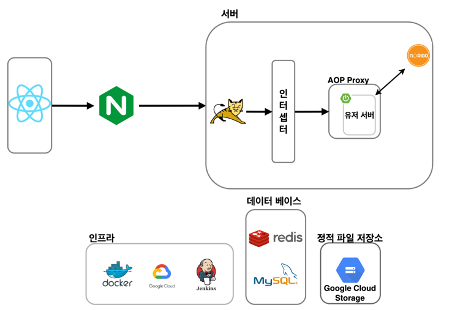
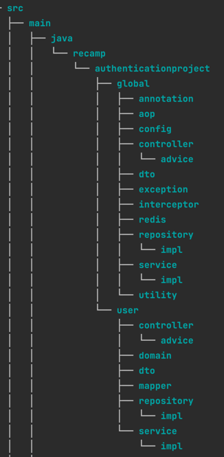
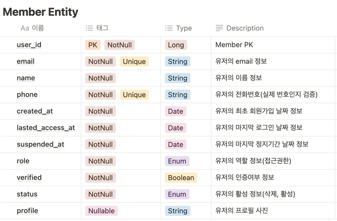
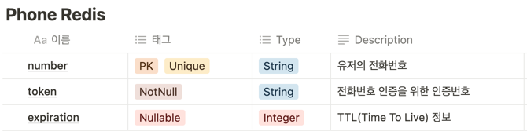
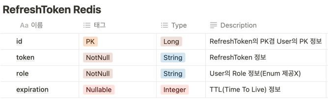
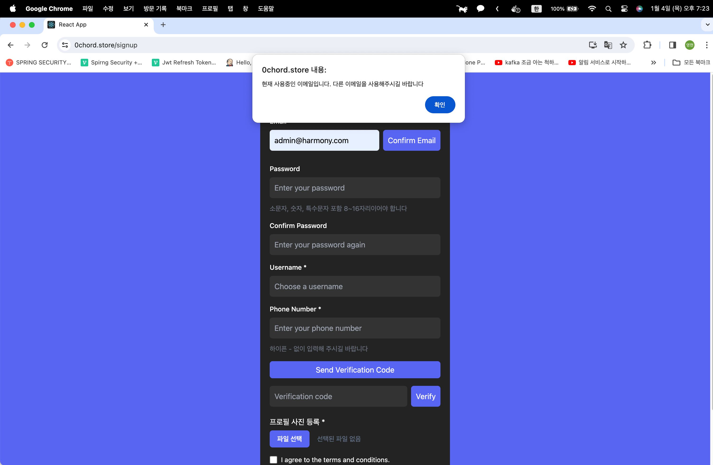
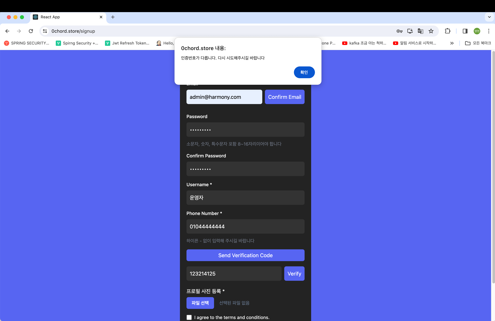
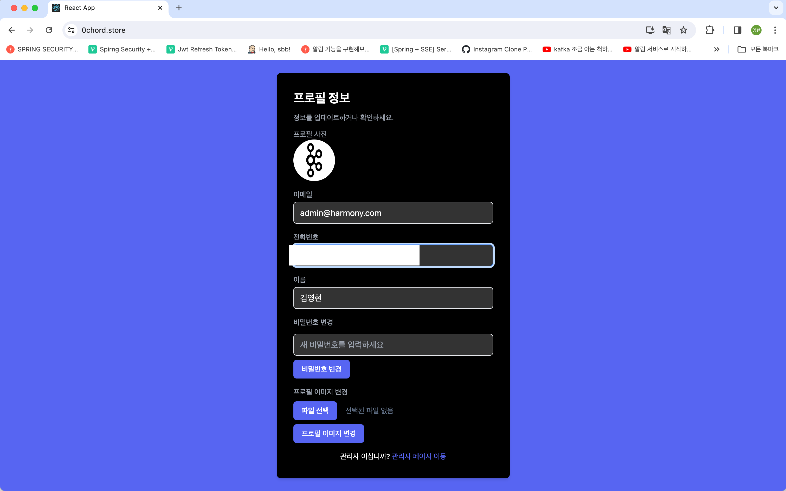
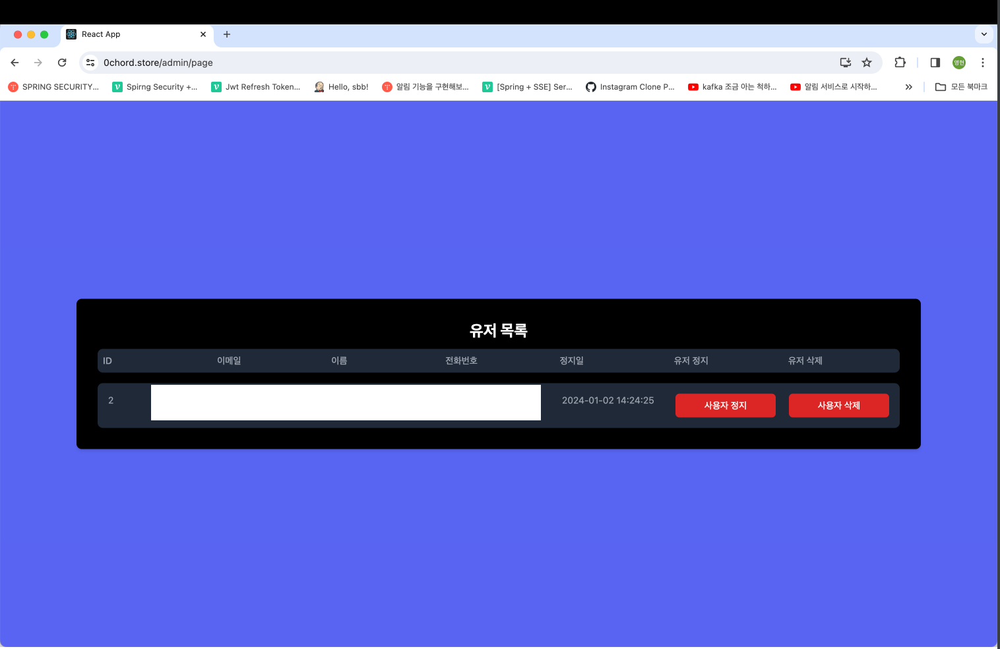

# Smilegate Re:Camp 개인 프로젝트 - 인증시스템 💻

## 💾 간단 프로젝트 설명

---

- [x] 이번 프로젝트는 스프링 시큐리티를 사용하지 않고 스프링 부트 기본 제공 라이브러리(Interceptor)와 Spring AOP를 활용하여 인증/인가 서비스를 구현하는 프로젝트
- [x] JWT 사용
- [x] 단순 구현이 아닌 지금까지의 학습한 내용을 가지고 코드 설계와 리팩토링을 할 예정
- [x] FE는 React를 사용하여 구성
- [x] 회원가입 시 회원 인증은 문자메시징 시스템을 활용하여 인증처리

## ✏️ 기술 스택

---

- [x] Java 17
- [x] Spring Boot 3.1.6
- [x] Spring Data JPA
- [x] React
- [x] Docker
- [x] Jenkins
- [x] MySQL
- [x] jsonwebtoken

## 🔎 프로젝트 요구 사항

---

- [x] 가입, 로그인 페이지
- [x] 유저 관리 페이지
- [x] 인증 서버 API
- [x] RDBMS DB 사용 : MySQL, MariaDB, PostgreSQL
- [x] Password Encryption
- [x] E-Mail 인증 (option)
- [x] 비밀번호 찾기 (option)
- [x] 캐시 (option)

## ✅ 예외 예측

---

- [x] 회원 가입
    - [x] 중복된 이메일 사용
    - [x] 휴대폰 인증 시 문자메세지 전송 실패
    - [x] 비밀번호, 검증 비밀번호 불일치
- [x] 로그인
    - [x] 아이디, 비밀번호 불일치
    - [x] 차단된 사용자 로그인 시도
- [x] 기능 사용
    - [x] accessToken 불일치 문제
    - [x] accessToken 만료 문제
    - [x] accessToken 만료 시 refreshToken 만료 문제

## 🎯 구현 기능 목록

---

- [x] Jenkins를 활용한 자동 배포
    - [x] GCP에 VM 생성
    - [x] Docker를 활용 배포
    - [x] SonarQube를 활용한 정적 검사 실행
- [x] Table 작성
    - [x] 개인 프로젝트이므로 Entity를 작성하여 바로 table 생성
- [x] 회원 가입
    - [x] 비밀번호 검증
    - [x] 문자메시지를 통한 전화번호 검증
    - [x] 중복 회원 검증
- [x] 로그인
    - [x] 아이디, 비밀번호 일치 검증
    - [x] 정지된 회원 검증
- [x] 기능 이용
    - [x] accessToken 검증
    - [x] refreshToken 검증
- [x] 매니저
    - [x] 회원 정지
    - [x] 회원 조회
- [x] 회원
    - [x] 비밀번호 변경
    - [x] 프로필 사진 변경

## 🔎 아키텍처

---

## 💾 디렉토리 구조

---

## 📖 DB Table

---

## 📝 API 명세서

---

### 회원 가입
#### 이메일 검증
- URL :  `/api/v1/verified/duplication/email`
- Method : `POST`
- Request
~~~json
{
	"email" : "example@example.com"
}
~~~
- Response
~~~java
"SUCCESS"
~~~
- Exception
~~~json
{
    "exception": "DuplicateEmailException",
    "code": 10007,
    "message": "중복된 회원 이메일입니다. 다른 이메일로 시도 부탁드립니다"
}
~~~
#### 전화번호 검증 요청
- URL :  `/api/v1/message/send`
- Method : `POST`
- Request
~~~json
{
    "phone":"01012341234"
}
~~~
- Response
~~~java
"SUCCESS"
~~~
- Exception
~~~json
{
    "exception": "MessageException", 
    "code": 10001, 
    "message": "메세지 전송에 실패했습니다. 다시 시도해주시길 바랍니다"
}
~~~
#### 전화번호 검증
- URL :  `/api/v1/message/validated`
- Method : `POST`
- Request
~~~json
{
    "number":"01012341234",
    "code":"7z4msqu4"
}
~~~
- Response
~~~java
"SUCCESS"
~~~
- Exception
~~~json
{
  "exception": "IllegalCodeException",
  "code": 10002,
  "message": "인증번호가 다릅니다. 다시 시도해주시길 바랍니다"
}
{
  "exception": "NoSuchElementException",
  "code": 20001,
  "message": "잘못된 시도입니다. 처음부터 다시 시도해주시길 바랍니다."
}
~~~
#### 회원가입
- URL :  `/api/v1/user/join`
- Method : `POST`
- Request
~~~json
{
  form-data
{
{
  "email":"example@example.com",
  "name":"김두한",
  "phone":"01012341234",
  "password":"1q2w3e4r!",
  "validationPassword":"1q2w3e4r!",
  "role":"USER",
  "verified":true
}-application/json,
image file
}
}
~~~
- Response
~~~java
"SUCCESS"
~~~
- Exception
~~~json
{
  "exception": "IllegalInputException",
  "code": 20002,
  "message": "잘못된 입력입니다. 다시 입력해주시길 바랍니다."
},
{
"exception": "IllegalPasswordException",
"code": 10004,
"message": "비밀번호가 일치하지 않습니다. 다시 시도 부탁드립니다"
},
{
"exception": "ConstraintViolationException",
"code": 10008,
"message": "중복된 계정입니다. 다른 계정으로 다시 시도해주시길 바랍니다"
}
~~~
### 로그인
- URL :  `/api/v1/verified/login`
- Method : `POST`
- Request
~~~json
{
  "email":"example@example.com",
  "password":"1q2w3e4r!"
}
~~~
- Response
~~~java
"SUCCESS"
~~~
- Exception
~~~json
{
  "exception": "NoSuchElementException",
  "code": 20001,
  "message": "잘못된 시도입니다. 처음부터 다시 시도해주시길 바랍니다."
},
{
  "exception": "IllegalInputException",
  "code": 20002,
  "message": "잘못된 입력입니다. 다시 입력해주시길 바랍니다."
},
{
  "exception": "UnauthorizedAccessException",
  "code": 10005,
  "message": "인증이 안된 회원입니다. 다시 가입해주시길 바랍니다"
},
{
  "exception": "DeleteMemberException",
  "code": 10009,
  "message": "운영자로부터 삭제된 회원입니다. 이용이 불가합니다"
}
~~~
### 관리자
#### 유저 목록 조회
- URL :  `/api/v1/admin/find/user`
- Method : `GET`
- Request
~~~json

~~~
- Response
~~~java
{"members":[
        {
        "userId":1,
        "email":"example@example.com",
        "name":"김두환",
        "phone":"01012341234"
        }
        ]
}
~~~
- Exception
~~~json
{
  "exception": "UnauthorizedAccessException",
  "code": 20004,
  "message": "인증에 실패했습니다. 재발급 받으시길 바랍니다."
}
~~~
#### 유저 정지
- URL :  `/api/v1/admin/suspend/user`
- Method : `POST`
- Request
~~~json
{
  "userId": 1,
  "day": 3
}
~~~
- Response
~~~java
"SUCCESS"
~~~
- Exception
~~~json
{
    "exception": "UnauthorizedAccessException",
    "code": 20004,
    "message": "인증에 실패했습니다. 재발급 받으시길 바랍니다."
}
~~~
#### 유저 삭제
- URL :  `/api/v1/admin/delete/user`
- Method : `POST`
- Request
~~~json
{
  "userId": 1
}
~~~
- Response
~~~java
"SUCCESS"
~~~
- Exception
~~~json
{
  "exception": "UnauthorizedAccessException",
  "code": 20004,
  "message": "인증에 실패했습니다. 재발급 받으시길 바랍니다."
},
{
"exception": "NoSuchElementException",
"code": 20001,
"message": "잘못된 시도입니다. 처음부터 다시 시도해주시길 바랍니다."
}
~~~
### 유저
#### 비밀번호 변경
- URL :  `/api/v1/user/{userId}/change/password`
- Method : `POST`
- Request
~~~json
{
  "password":"1q2w3e4r!"
}
~~~
- Response
~~~java
"SUCCESS"
~~~
- Exception
~~~json
{
  "exception": "IllegalInputException",
  "code": 20002,
  "message": "잘못된 입력입니다. 다시 입력해주시길 바랍니다."
},
{
"exception": "UnauthorizedAccessException",
"code": 20004,
"message": "인증에 실패했습니다. 재발급 받으시길 바랍니다."
}
~~~
#### 이미지 변경
- URL :  `/api/v1/user/{userId}/change/profile-image`
- Method : `PATCH`
- Request
~~~json
form-data
image - file
~~~
- Response
~~~java
"SUCCESS"
~~~
- Exception
~~~json
{
  "exception": "IllegalInputException",
  "code": 20002,
  "message": "잘못된 입력입니다. 다시 입력해주시길 바랍니다."
},
{
  "exception": "UnauthorizedAccessException",
  "code": 20004,
  "message": "인증에 실패했습니다. 재발급 받으시길 바랍니다."
}
~~~
#### 프로필 정보 조회
- URL :  `/api/v1/user/{userId}/get-profile`
- Method : `GET`
- Request
~~~json
~~~
- Response
~~~java
{
        "email": "example@example.com",
        "name": "임꺽정",
        "phone": "01012341234",
        "image": "https://example.storage.com/example/addr"
}
~~~
- Exception
~~~json
{
  "exception": "UnauthorizedAccessException",
  "code": 20004,
  "message": "인증에 실패했습니다. 재발급 받으시길 바랍니다."
}
~~~
## 💾 실행 화면
#### 이메일 중복 인증

#### 전화번호 인증

#### 사진 등록

#### 개인 프로필 화면

#### 관리자 화면
